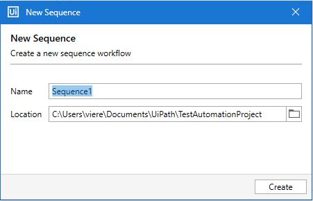

Exercício II
=====================

**Exercício II** 
###################
Capturar dados de uma página web e salvá-los em uma planilha do Excel
*********************************************************************
Neste exercício, iremos realizar scraping de uma página web – fakenamegenerator.com – 50 vezes e salva os dados em uma planilha do Excel.

**I – Crie uma nova sequência**
*******************************
Crie uma nova sequência clicando em **New -> Sequence**.

.. figure:: ./images/ex1_new_sequence.png

**II - Escolha o nome da nova sequência**
*****************************************
Escolha o nome da nova sequência no diálogo que aparecerá.

**III – Sequência vazia**
*************************
Aparecerá uma caixa contendo a sequência vazia.

.. figure:: ./images/ex1_drop_sequence.png

 
**IV – Insira Open Browser na sequência**
*****************************************
Arraste Open Browser para a sequência, contido em **UI Automation -> Open Browser**.

.. figure:: ./images/ex2_add_open_browser.png
 

**V – Selecionar navegador**
****************************
Clique na aba Properties e selecione o navegador a ser utilizado.

**VI – Inserir URL**
********************
Insira a URL desejada (“http://www.fakenamegenerator.com”, no nosso caso).

.. figure:: ./images/ex2_insert_url.png

**VII – Inserir Input Dialog na sequência**
*******************************************
Arraste um Input Dialog para a sequência, contido em System -> Dialog -> Input Dialog e preencha-o com o título “Enter details” e label “Entre com o número de consumidores”.

 
**VIII – Criar variável que alocará número de ciclos**
******************************************************
Crie uma variável “numero” para especificar a quantidade de vezes que iremos procurar por dados na página - no nosso caso "number".

.. figure:: ./images/ex2_add_cycles_variable.png

**IX – Configure a saída do Input Dialog**
******************************************
Abra a aba propriedades e coloque a variável “numero” como saída do Input Dialog.

.. figure:: ./images/ex2_configure_input_dialog.png

**X – Criar Loop Do While**
***************************
Arraste a atividade Do While para a sequência dentro da atividade Do, do Open Browser. Está contida em **Workflow -> Control -> Do While**.

.. figure:: ./images/ex2_add_do_while_loop.png
 
**XI – Adicionar Condição de Parada**
*************************************
Coloque a expressão “val < Cint(number)” como condição de parada (Condition) do ciclo.
 
 .. figure:: ./images/ex2_add_stop_condition.png

**XII – Inserir atividade Assign**
**********************************
Arraste a atividade Assign, contida em **System -> Activities -> Statements**, para a sequência dentro do Body e assinale seu valor como **val = val + 1**.

 .. figure:: ./images/ex2_add_assign.png

**XIII – Inserir GetFullText**
******************************
Arraste a atividade Get Full Text, contida em **UI Automation -> Text -> Screen Scraping** para a sequência.

**XIV – Inserir Nome**
**********************
Clique em ‘Indicate element inside browser’ e selecione o nome dentro da página do site Fake Name Generator

**XV – Criar Variável Nome**
****************************
Crie uma variável “nome” e especifique-a como saída da atividade Get Full Text.

**XVI – Repertir Passos XIV e XV**
**********************************
Repita os passos XIV e XV mas para as variáveis “telefone” e “datanascimento”.

**XVII – Criar DataTable**
**************************
Agora criaremos uma tabela de dados, para isso arraste a atividade Build Data Table, contida em **Programming -> DataTable**, à sequência, logo abaixo de Input Dialog.

.. figure:: ./images/ex2_add_data_table.png

**XVIII – Preencher campos DataTable**
**************************************
Adicione os campos na tabela, clicando em DataTable... e preenchendo os campos

**XIX – Criar variável que irá conter DataTable**
*************************************************
Crie uma variável para guardar os resultados com o nome de “ExtracaoDataTable”.

.. figure:: ./images/ex2_add_data_table_variable.png

**XX – Alterar tipo da variável**
*********************************
Crie uma variável para guardar os resultados com o nome de “ExtracaoDataTable”.

.. figure:: ./images/ex2_change_var_type_2.png

**XXI – Adicionar atividade AddDataRow**
***************************************
Arraste a atividade Add Data Row, contida em **Programming -> DataTable**, à sequência, logo abaixo de Get Full Text.

**XXII – Assinalar AddDataRow**
*******************************
Assinale à ArrayRow da atividade Add Data Row o dicionário contendo o nome, telefone e datanascimento ({nome,telefone,datanascimento}) e DataTable o nome da DataTable que definimos no passo XVIII.

.. figure:: ./images/ex2_assign_data_row.png

**XXIII - Configurar Página para Atualizar**
********************************************
Precisamos atualizar a página toda vez que quisermos um registro novo, faremos isso clicando no botão Generate, que gera outro registro. Para fazer isso, arraste a atividade Click, contida em **UI Automation -> Element -> Mouse** e defina o elemento da página desejado clicando em “Indicate element inside browser”. O elemento é o botão Generate na página.

.. figure:: ./images/ex2_click_generator.png