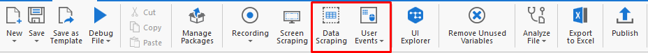
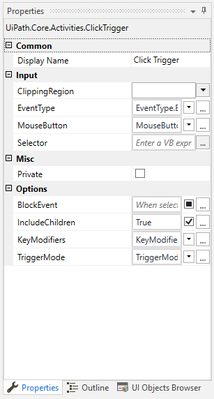

Guia para a Interface
=====================

**I. O que é RPA?** 
###################
 RPA vem de Robotic Process Automation, que traduzido para o português torna-se "Automação Robótica de Processos".

**Automação**

 Automação ocorre quando uma tarefa acontece automaticamente, ie. **sem intervenção humana**.

**Robótica**

 Um robô é uma entidade capaz de ser programada por um computador para realizar tarefas complexas. Em termos de ARP, esta tarefa seria **imitar ações humanas**.

**de Processos**
 Um processo é uma **sequência de passos**, que levam a uma atividade ou tarefa significativa.

**II. Começando no UiPath**
###########################
Conceitos-chave
****************
**Atividades**
 Uma atividade é a menor ação possível no UIPath. Por exemplo, clicar com o botão esquerdo do mouse.

**Sequências**
 Uma sequência é uma série de atividades que, em conjunto, realizam uma tarefa significativa. Por exemplo, entrar no seu e-mail.

**2.1 - Tipos de Projetos**
***************************
**Blank - Em branco**
 Um projeto em branco é uma "tábula rasa" em que você pode construir seus projetos do zero.

**Simple Process - Processo Simples**
 Um processo simples basicamente nos dá um modelo de um fluxograma ie. um diagrama de uma sequência de atividades.

**Agent Process Improvement - Melhoria de Processos de Agente**
 Auxilia o usuário a automatizar as tarefas.

eg. configurar atalhos para cada tarefa

**Transactional Business Process - Processo de Negócios Transacional**
 É utilizado para definir estados em um projeto, que são úteis em processos de negócio.

**2.2 – Componentes do UIPath**
********************************
**2.2.1 - Ribbon / Barra de Navegação**
***************************************
Recording – Gravação
********************
 O gravador do UIPath permite aos usuários gravar movimentos do mouse e atividades do teclado dentro da interface deu suário para gerar scripts de automação.

.. image:: ./images/ribbon_recording.png

Como utilizar:

- Clique no botão

- Realize a atividade que você quer automatizar

- Pressione o botão 'ESC'

Scraping - Aquisição de Dados
*****************************
 É utilizado para extrair informações da tela ou de dados provenientes de uma fonte externa.

User Events - Eventos de Usuário
********************************

 Captura entradas que o usuário dá à interface e executa a ação. As entradas podem ser clicks do mouse, teclas pressionadas, rolagens de tela, etc.

.. image:: ./images/ribbon_events.png

Remove Unused Variables - Remover Variáveis Não-utilizadas 
**********************************************************
 É utilizado para remover variáveis inutilizadas. Elas podem ser utilizadas caso exista um valor que mude durante o fluxo do programa ou para passar seu valor para outro componente.

.. image:: ./images/ribbon_remove_variables.png

New – Novo
**********

.. figure:: ./images/ribbon_new.png

 Utilizado para criar arquivos dentro do projeto.

Sequência
*****************
.. figure:: ./images/ribbon_new_sequence.png

 Cria uma nova sequência em branco.

Fluxograma
**********
.. figure:: ./images/ribbon_new_flowchart.png
   :align: center
   :figclass: align-center

Cria um novo modelo de fluxograma.

State Machine - Máquina de Evento
*********************************

 Cria um novo modelo de máquina de estado.

**2.2.2 – Painel de Atividades**
********************************
 O painel de atividades exibe todas as atividades disponíveis para uso na automação de tarefas.

**Computer Vision - Visão Computacional**
*****************************************

.. figure:: ./images/activity_cv.png

 Contém atividades relacionadas à algoritmos de visão computacional.

**Orchestrator - Orquestrador**
*******************************

 Gerenciamento de atividades distribuídas entre vários computadores.

**Programming - Programação**
*****************************
.. figure:: ./images/activity_programming.png

 Aqui estão atividades destinadas a problemas comuns em programação, como fluxo de controle, tratamento de exceções, etc.

**System - Sistema**
********************
.. figure:: ./images/activity_cv.png

 Atividades relacionadas ao sistema, eg. copiar para a área de transferência, deletar arquivo.

**Testing - Testes**
********************

 Atividades relacionadas a testes internos da atividade.

**UI Automation - Automação de Interface de Usuário**
*****************************************************

  Nesta seção estão contidas atividades concernentes à automação de eventos da interface.

- **Element - Elemento**
 Eventos de mouse, eventos de teclado, eventos de texto.
- **Image - Imagem**
 Eventos de imagem.
- **OCR – Optical Character Recognition – Reconhecimento Óptico de Caracteres**
 Extrair texto de imagens.
- **User Events - Eventos de Usuário**
 Gatilhos do usuário.
- **Workflow - Fluxo de Trabalho**
 Atividades que estão dentro de fluxogramas. Geralmente envolvem tomada de decisão por parte do sistema.

**2.3 - Painel de Propriedades**
********************************

Mostra as principais propriedades para a atividade atualmente selecionada.

**Variáveis** - variáveis definidas para a atividade atual.
 .. figure:: ./images/property_variables.png

**Argumentos** - podem ser passados para outros arquivos enquanto variáveis não podem.
 .. figure:: ./images/property_arguments.png

**Importações** - lista todas as atividades que serão importadas por padrão quando você tentar criar seu programa.
 .. figure:: ./images/property_imports.png 
